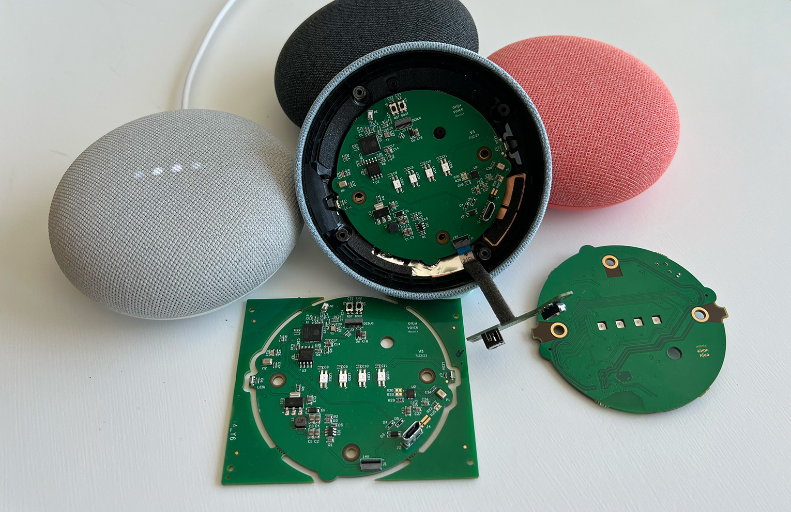
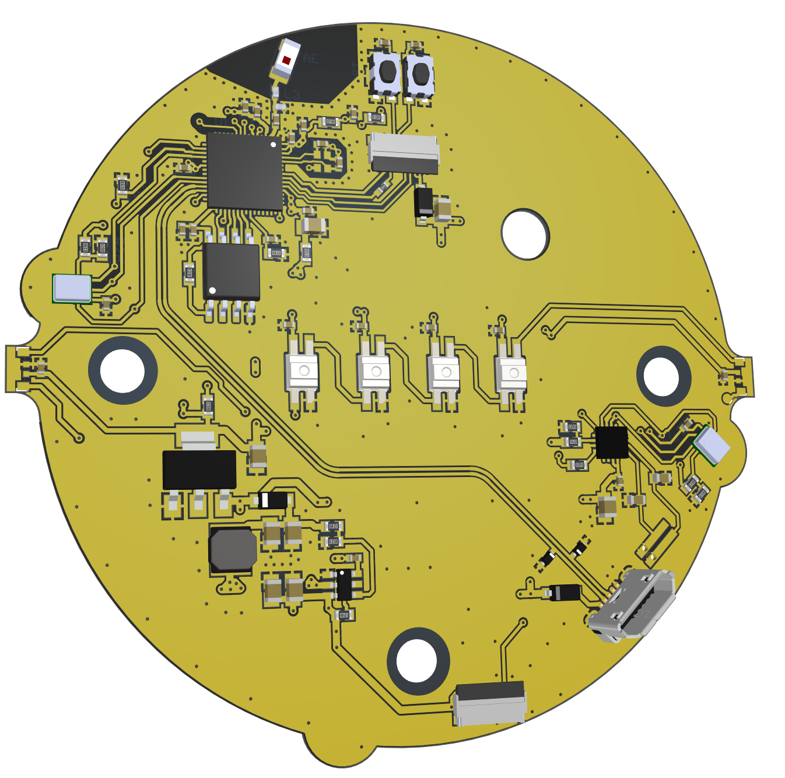
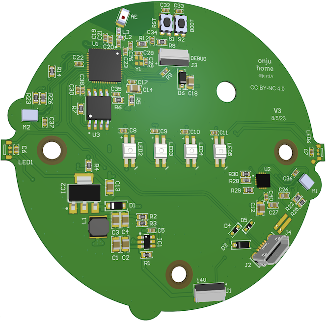

# Onju Voice v2 (OnjuClaw 🍐🦞 ?)

Enable multiple "Google Home" speakers to connect to your Mac Mini for talking to your agent(s).

This repo consists of:
* An async server pipeline handling ASR -> TTS from multiple devices using any LLM or agent platforms like OpenClaw 🦞
* Hardware designs for a drop-in replacement PCB to the original Google Nest Mini (2nd gen), using the ESP32-S3 for audio processing and WiFi connectivity

> This is an upgraded version of [onju-voice](https://github.com/justLV/onju-voice) as DEMO'd [here](https://x.com/justLV/status/1681377298308820992?s=20)!.



## What's new in v2

* **OpenClaw managed backend** 🦞 -- delegate conversation history and session management to an [OpenClaw](https://github.com/openclaw) gateway for centralized, multi-device orchestration
* **Opus compression** -- 14-16x downstream compression (server to speaker) for better audio quality over WiFi
* **Streaming-ready architecture** -- designed for sentence-level TTS streaming and agentic tool-calling loops
* **Modular async pipeline** -- replaced the monolithic server with a pluggable architecture for ASR, LLM, and TTS backends etc.
* **Any LLM** -- works with any OpenAI-compatible API (Ollama, mlx_lm, Gemini, OpenRouter, Claude, etc.)
* **Pluggable TTS** -- ElevenLabs (recommended) or local via [mlx-audio](https://github.com/lucasnewman/mlx-audio) for fully offline operation
* **Silero VAD** -- server-side voice activity detection with configurable thresholds, replacing webrtcvad
* **VAD-aware interruption** -- tap to interrupt playback and start speaking immediately
* **M5 Echo support** -- get started with a [$13 dev kit](https://shop.m5stack.com/products/atom-echo-smart-speaker-dev-kit) instead of ordering a custom PCB
* **One-command flashing** -- `./flash.sh` handles compilation, WiFi credential generation (from macOS Keychain), and upload. No Arduino IDE or manual configuration required

## Supported devices

| | Onjuino (custom PCB) | M5Stack ATOM Echo |
|---|---|---|
| **Board** | ESP32-S3 | ESP32-PICO-D4 |
| **Interaction** | Capacitive touch: tap to start (uses VAD to end) | Physical button: hold to talk |
| **Mic** | I2S (INMP441) | PDM (SPM1423) |
| **Speaker** | MAX98357A, 6 NeoPixel LEDs | NS4168, 1 SK6812 LED |
| **PSRAM** | Yes (2MB playback buffer) | No (smaller buffers) |
| **Audio upstream** | mu-law 16kHz UDP (16 KB/s) | mu-law 16kHz UDP (16 KB/s) |
| **Audio downstream** | Opus 16kHz TCP (~1.5 KB/s) | Opus 16kHz TCP (~1.5 KB/s) |

Both targets use the same network protocol and connect to the same server. See the [M5 Echo README](m5_echo/README.md) for hardware-specific details.

## Architecture

```
                ESP32 Device                              Server Pipeline
  ┌──────────────────────────────┐       ┌──────────────────────────────────────┐
  │  Mic > I2S RX > mu-law =======UDP 3000===> mu-law decode > VAD > ASR        │
  │                              │       │                                      │
  │  Speaker < I2S TX < Opus <===TCP 3001<=== Opus encode < TTS < LLM           │
  └──────────────────────────────┘       └──────────────────────────────────────┘
```

**Why mu-law upstream:** Stateless sample-by-sample encoding (~1% CPU), zero buffering latency. ASR models handle the quality fine.

**Why Opus downstream:** Human ears need better quality than ASR, and Opus decoding is easier for an ESP32. Opus gives 14-16x compression vs mu-law's 2x, and TCP ensures reliable ordered delivery for the stateful codec.

### Device discovery

1. ESP32 boots and joins WiFi
2. Sends multicast announcement to `239.0.0.1:12345` with hostname, git hash, and PTT flag
3. Server discovers device and connects to its TCP server on port 3001
4. ESP32 learns server IP from the TCP connection and starts sending mic audio via UDP

### TCP command protocol

All commands use a 6-byte header. The server initiates TCP connections to the ESP32.

| Byte 0 | Command | Payload |
|---|---|---|
| `0xAA` | Audio playback | mic_timeout(2B), volume, LED fade, compression type, then length-prefixed Opus frames |
| `0xBB` | Set LEDs | LED bitmask, RGB color |
| `0xCC` | LED blink (VAD) | intensity, RGB color, fade rate |
| `0xDD` | Mic timeout | timeout in seconds (2B) |

A zero-length Opus frame (`0x00 0x00`) signals end of speech.

### FreeRTOS task layout

| Core | Task | Purpose |
|---|---|---|
| Core 0 | Arduino loop | TCP server, touch/mute input, UART debug |
| Core 1 | `micTask` | I2S read, mu-law encode, UDP send |
| Core 1 | `opusDecodeTask` | TCP read, Opus decode, I2S write (created per playback) |
| Core 1 | `updateLedTask` | 40Hz LED refresh with gamma-corrected fade |

### Conversation backends

The pipeline supports two conversation backends, selectable via `config.yaml`:

**Local** (`conversation.backend: "local"`): Manages conversation history locally with per-device JSON persistence. Sends the full message history on each LLM request. Works with any OpenAI-compatible endpoint.

**OpenClaw Managed** (`conversation.backend: "managed"`): Delegates session management to an [OpenClaw](https://github.com/openclaw) gateway. Only sends the latest user message -- OpenClaw tracks history server-side using the device ID as the session key. Set `OPENCLAW_GATEWAY_TOKEN` in your environment and point `base_url` at your gateway.

### Setting up OpenClaw

If you have [OpenClaw](https://github.com/openclaw) installed, a setup script is included:

```bash
./setup_openclaw.sh
```

This will:
1. Enable the chat completions HTTP endpoint on the gateway
2. Append a voice mode prompt to `~/.openclaw/workspace/AGENTS.md` (tells the agent to respond in concise, speech-friendly prose when the message channel is `onju-voice`)
3. Restart the gateway

Then set `conversation.backend: "managed"` in `pipeline/config.yaml` and ensure `OPENCLAW_GATEWAY_TOKEN` is set in your environment.

## Installation

### Server

```bash
# Clone and set up Python environment
git clone https://github.com/justLV/onju-v2.git
cd onju-v2
uv venv && source .venv/bin/activate
uv pip install -e .

# macOS: install system libraries for Opus encoding
brew install opus portaudio

# Configure
cp pipeline/config.yaml.example pipeline/config.yaml
# Edit config.yaml with your API keys and preferences
```

**ASR** -- an embedded [parakeet-mlx](https://github.com/senstella/parakeet-mlx) server is included (Apple Silicon):
```bash
uv pip install -e ".[asr]"
python -m pipeline.services.asr_server  # runs on port 8100
```
Or point `asr.url` in config.yaml at any Whisper-compatible endpoint.

**LLM** -- any OpenAI-compatible server:
```bash
# Local (mlx_lm on Apple Silicon)
mlx_lm.server --model unsloth/gemma-4-E4B-it-UD-MLX-4bit --port 8080

# Local (Ollama)
ollama run gemma4:e4b

# Cloud -- just set base_url and api_key in config.yaml (default: Haiku via OpenRouter)
```

**TTS** -- [ElevenLabs](https://elevenlabs.io) is the default (set your API key in config.yaml). For fully offline TTS, you can use [mlx-audio](https://github.com/lucasnewman/mlx-audio) (`uv pip install -e ".[tts-local]"`, then set `tts.backend: "qwen3"` for example in config.yaml - I don't think this is the best quality, just including as reference for a local TTS!).

**Run:**
```bash
source .venv/bin/activate
python -m pipeline.main
```

### Firmware

Both targets can be compiled and flashed from the command line:

```bash
# Flash onjuino (default)
./flash.sh

# Flash M5 Echo
./flash.sh m5_echo

# Compile only (no device needed)
./flash.sh compile

# Regenerate WiFi credentials from macOS Keychain, defaults to manual entry
./flash.sh --regen
```

Requires `arduino-cli`:
```bash
# macOS
brew install arduino-cli
arduino-cli core install esp32:esp32
```
The flash script auto-installs required libraries (Adafruit NeoPixel, esp32_opus).

WiFi credentials are generated from your macOS Keychain on first flash, or you can edit the `credentials.h.template` files manually.

For Arduino IDE users: select **ESP32S3 Dev Module** (onjuino) or **ESP32 Dev Module** (M5 Echo), enable **USB CDC on Boot** and **OPI PSRAM** (onjuino only), then build and upload.

### Hardware

<p float="left">
  
  
</p>

[Preview schematics & PCB](https://365.altium.com/files/77C755F4-7195-4B29-93AA-0C10A2471AC3) | [Order from PCBWay](https://www.pcbway.com/project/shareproject/Onju_Voice_d33625a1.html) | Altium source files and schematics in `hardware/`.

If you don't have a custom PCB, you can use the [M5Stack ATOM Echo](https://shop.m5stack.com/products/atom-echo-smart-speaker-dev-kit). I'd recommend adding a Battery ([Biscuit](https://www.youtube.com/watch?v=OMg3epr53Ns)) Base ([link](https://shop.m5stack.com/products/atomic-battery-base-200mah))

## Configuration reference

See [`pipeline/config.yaml.example`](pipeline/config.yaml.example) for all options. Key sections:

| Section | What it controls |
|---|---|
| `asr` | Speech-to-text service URL |
| `conversation.backend` | `"local"` or `"managed"` (OpenClaw) |
| `conversation.local` | LLM endpoint, model, system prompt, message history |
| `conversation.managed` | OpenClaw gateway URL, auth token, message channel |
| `tts` | TTS backend (`"elevenlabs"` or `"qwen3"`), voice settings |
| `vad` | Voice activity detection thresholds and timing |
| `network` | UDP/TCP/multicast ports |
| `device` | Volume, mic timeout, LED settings, greeting audio |

### Environment variables

| Variable | Used by |
|---|---|
| `OPENROUTER_API_KEY` | Local backend via OpenRouter (default) |
| `ANTHROPIC_API_KEY` | Local backend via Anthropic API directly |
| `OPENCLAW_GATEWAY_TOKEN` | Managed (OpenClaw) backend |

## Testing

```bash
# Emulate an ESP32 device (no hardware needed)
python test_client.py                  # localhost
python test_client.py 192.168.1.50     # remote server

# Test speaker output (send audio file to device w/ TCP and Opus encoding)
python test_speaker.py <device-ip>

# Test mic input (receive and record UDP audio)
python test_mic.py --duration 10

# Serial monitor (auto-detects USB port)
python serial_monitor.py test.wav
```

## UART debug commands

Both firmware targets support serial commands at 115200 baud:

| Key | Action |
|---|---|
| `r` | Reboot |
| `M` | Enable mic for 10 minutes |
| `m` | Disable mic |
| `A` | Re-send multicast announcement |
| `c` | Enter config mode (WiFi, server, volume) |
| `W`/`w` | LED test fast/slow (onjuino) |
| `P` | Play 440Hz test tone (M5 Echo) |

## License

MIT
